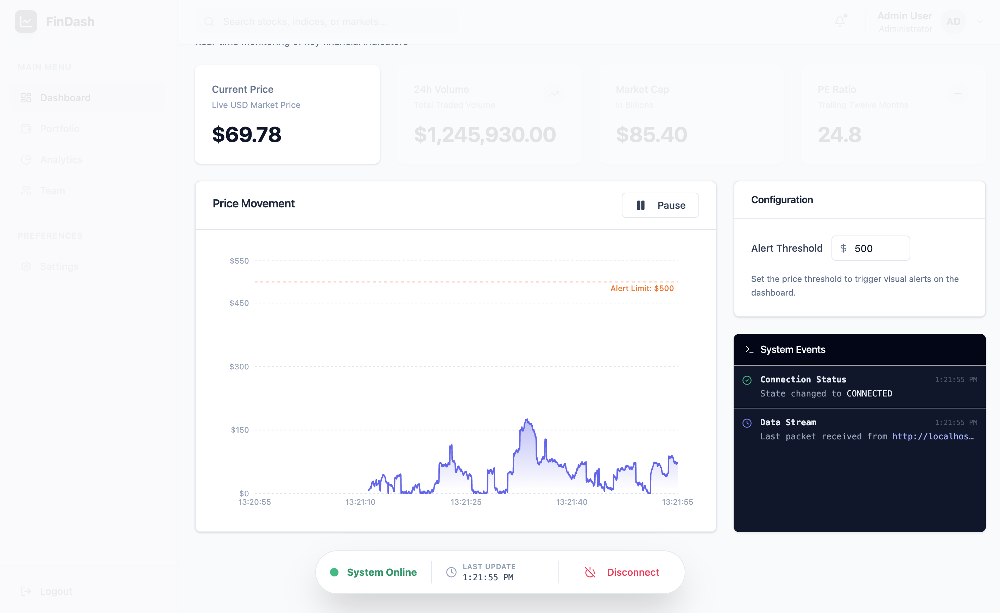
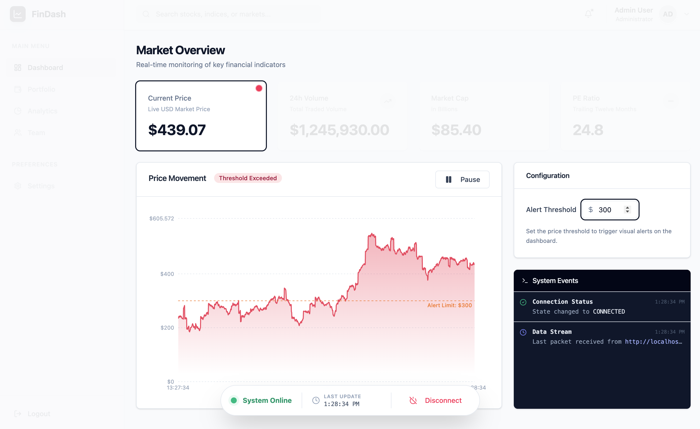
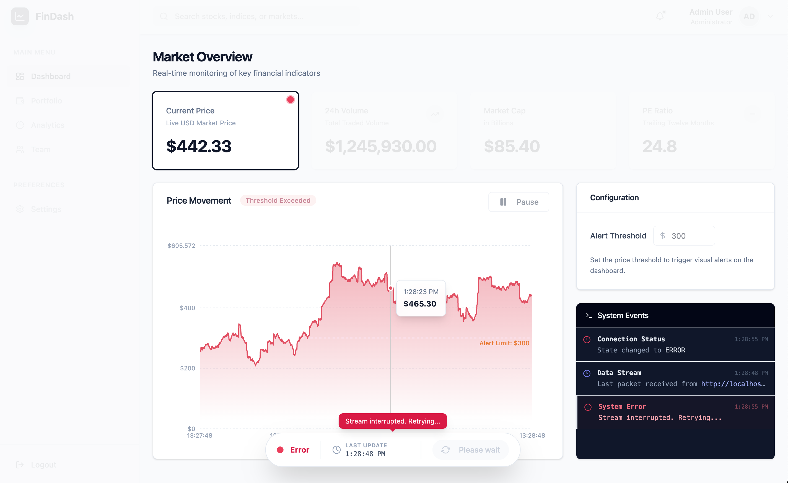

# Stock Monitor Dashboard

A realtime stock monitoring application built as a monorepo, featuring:
- A React frontend, and
- A Node.js backend utilizing Server-Sent Events (SSE) for live data streaming.



## Getting Started

Follow these instructions to set up and run the project on your local machine.

### Prerequisites

- **Node.js**: version 18 or higher
- **npm**: version 10 or higher

### Installation

1.  Navigate to the `monorepo` directory:
    ```bash
    cd monorepo
    ```

2.  Install dependencies for all workspaces:
    ```bash
    npm install
    ```

### Running the Application

You can start the entire application (Frontend + Backend) with a single command:

```bash
npm run dev
```

This will launch:
-   **Frontend (Admin):** [http://localhost:3001](http://localhost:3001)
-   **Backend (API):** [http://localhost:5001](http://localhost:5001)

#### Running Services Individually

If you prefer to run services in separate terminals:

**Frontend only:**
```bash
npm run dev:admin
```

**Backend only:**
```bash
npm run dev:api
```

### Building for Production

To build all packages and applications:

```bash
npm run build
```

## Architecture

This project is structured as a **monorepo** using npm workspaces, designed to separate concerns while sharing common configurations and utilities.

### Structure

-   **`apps/admin`**: The frontend application.
    -   **Tech Stack**: React, Vite, TypeScript, Tailwind CSS, ShadcnUI, Recharts.
    -   **Key Features**: Realtime stock charting, system logs panel, connection status monitoring.
    -   **Communication**: Consumes Server-Sent Events (SSE) from the API.
-   **`apps/api`**: The backend service.
    -   **Tech Stack**: Node.js, Express, TypeScript.
    -   **Key Features**: Generates mock stock data, broadcasts updates via SSE, handles graceful shutdowns.
-   **`packages/*`**: Shared internal libraries.
    -   `@repo/logger`: specific logging utility.
    -   `@repo/config-eslint`: Shared linting rules.
    -   `@repo/config-typescript`: Shared TSConfig bases.

### ⚖️ Architectural Decisions & Trade-offs

1.  **Server-Sent Events (SSE) vs. WebSockets**:
    -   **Decision**: Used SSE for real-time updates.
    -   **Reasoning**: The data flow is primarily unidirectional (server -> client) for stock updates. SSE is simpler to implement, works over standard HTTP, and is natively supported by browsers with automatic reconnection logic. WebSockets would be overkill unless bidirectional realtime communication was required.

2.  **Monorepo Structure**:
    -   **Decision**: Used npm workspaces.
    -   **Reasoning**: Allows for shared configuration (ESLint, TSConfig) and utility packages (`@repo/logger`) without publishing to a registry. It ensures consistency across the frontend and backend codebases.

3.  **Pause vs. Close Connection**:
    -   **Decision**: "Pausing" the dashboard does not close the SSE connection.
    -   **Reasoning**: This is a client-side optimization. Keeping the connection open ensures that when the user resumes, data starts flowing immediately without the latency of re-handshaking and re-establishing the TCP/HTTP connection. It also maintains a stable session state.

4.  **React vs. Next.js**:
    -   **Decision**: Used React (SPA) with Vite.
    -   **Reasoning**: The application is a highly dynamic, client-side rich dashboard. Next.js features like Server-Side Rendering (SSR) or Static Site Generation (SSG) provide little benefit here and would add unnecessary complexity. Vite provides a simpler, faster build toolchain for this specific use case.

5.  **Express.js vs. NestJS**:
    -   **Decision**: Used Express.js.
    -   **Reasoning**: For a focused microservice handling a single stream of events, Express provides a lightweight and flexible foundation. NestJS was considered but deemed "too heavy" (opinionated architecture, dependency injection boilerplate) for the scope of this assessment.

## Screenshots

### Exceeding Threshold


### Disconnected
